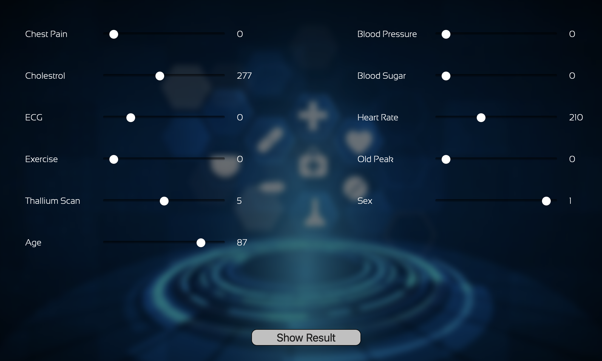

# Fuzzy System

> Instructor: [Dr. M. Ebadzadeh](https://scholar.google.com/citations?user=080Y_lUAAAAJ&hl=en)

> Semester: Spring 2022

In this project, our goal is to design a fuzzy expert system to detect whether a person has heart disease. 

The inputs to this problem include the following:
Chest pain, blood pressure, ECG1, maximum heart rate, sports activity, Old peak, amount of thallium, gender, age.

Finally, the outcome determines whether or not a person has heart disease.
